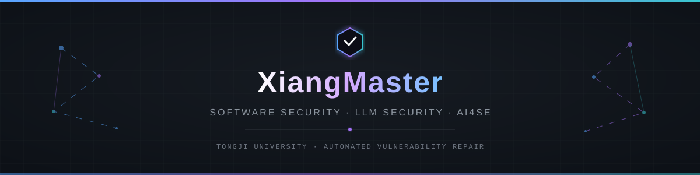

<!-- =========================================================
                       XIANGMASTER
              GitHub Profile README
========================================================== -->


<!-- ===================== HEADER ===================== -->

<p align="center">
  
</p>

<p align="center">
  
</p>

<p align="center">
  <a href="mailto:rxwu@tongji.edu.cn">
    
  </a>
  <a href="https://github.com/xiangmaster">
    
  </a>
  
</p>


<!-- ===================== ABOUT ===================== -->

## `> about_me.py`

```python
xiangmaster = {
    "school": "Tongji University",
    "major": "Software Engineering",

    "research": [
        "Automated Vulnerability Repair",
        "Software Security",
        "LLM / Agent Security",
        "AI for Software Engineering",
    ],

    "current_focus": {
        "primary": "LLM-based Vulnerability Repair",
        "topics": [
            "Multi-hunk Repair",
            "Context Selection",
            "Program Analysis",
            "Repair Workflows",
        ],
    },

    "interests": [
        "🥁 Drums",
        "🎾 Tennis",
    ],
}
```

<p align="center">
  
  
  
  
  
  
</p>

> 🔐 Interested in combining **Large Language Models + Program Analysis** to understand, detect, and repair software vulnerabilities.
>
> 🚀 Currently exploring **LLM-based program repair, agent security, and secure intelligent software systems**.


<!-- ===================== RESEARCH ===================== -->

## `> research_projects`

### 🔧 01 · Automated Vulnerability Repair

> [!IMPORTANT]
> ### Primary Research Focus
> **LLM-based Automated Vulnerability Repair**
>
> My primary research focuses on leveraging **large language models for automated vulnerability repair**, especially complex vulnerabilities that require richer contextual information and multi-step repair workflows.

<p align="center">
  
  
  
  
</p>

**What I'm exploring**

- 🧩 Repairing vulnerabilities involving **multiple hunks and locations**
- 🧠 Selecting and organizing **useful program context**
- 🔄 Designing **structured multi-step repair workflows**
- 🔍 Combining **program analysis with LLM reasoning**
- ✅ Improving the reliability of generated security patches

<p>
  <code>Automated Program Repair</code>
  <code>Vulnerability Repair</code>
  <code>LLM</code>
  <code>AI4SE</code>
  <code>Program Analysis</code>
</p>

---

### 🪄 02 · SpellSmith

> [!NOTE]
> ### MCP Ecosystem Security
>
> Studying security risks in the **Model Context Protocol ecosystem**, with a focus on vulnerable information flows and missing security information in MCP servers.
>
> Exploring **metadata-enhanced and runtime defense mechanisms** for securing LLM agents.

<p>
  
  
  
  
</p>

---

### 🦠 03 · PolarCatch

> [!TIP]
> ### Dormant Ransomware Detection
>
> Exploring techniques for detecting **dormant ransomware** by combining program analysis, LLM-derived semantic information, and graph-based learning.
>
> Focusing on malicious behaviors that remain hidden before activation.

<p>
  
  
  
  
</p>


<!-- ===================== TECH STACK ===================== -->

## `> tech_stack`

<div align="center">

### 💻 Languages


### 🤖 AI · Data · Research


&nbsp;

&nbsp;

&nbsp;


### 🐧 Systems · Engineering


### 🌐 Web · Database


</div>

<p align="center">
  
  
  
  
  
  
</p>


<!-- ===================== GITHUB ===================== -->

## `> github_overview`

<p align="center">
  
</p>

<p align="center">
  
  
  
</p>

<p align="center">
  
</p>


<!-- ===================== CONTACT ===================== -->

## `> contact`

```text
research/
├── automated-vulnerability-repair
├── software-security
├── llm-agent-security
└── ai-for-software-engineering

contact/
├── github  : @xiangmaster
└── email   : rxwu@tongji.edu.cn
```

<p align="center">
  <a href="mailto:rxwu@tongji.edu.cn">
    
  </a>
  <a href="https://github.com/xiangmaster">
    
  </a>
</p>

<p align="center">
  <i>
    Exploring how software breaks — and how intelligent systems can make it safer.
  </i>
</p>
